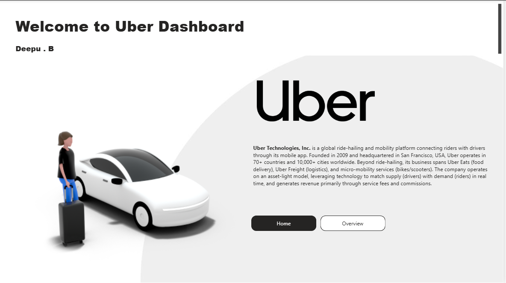
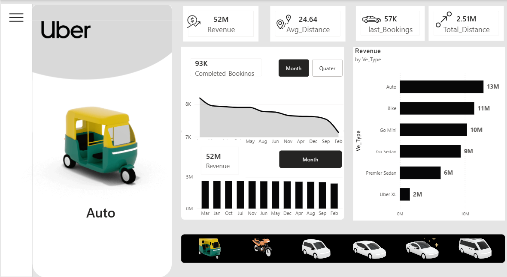
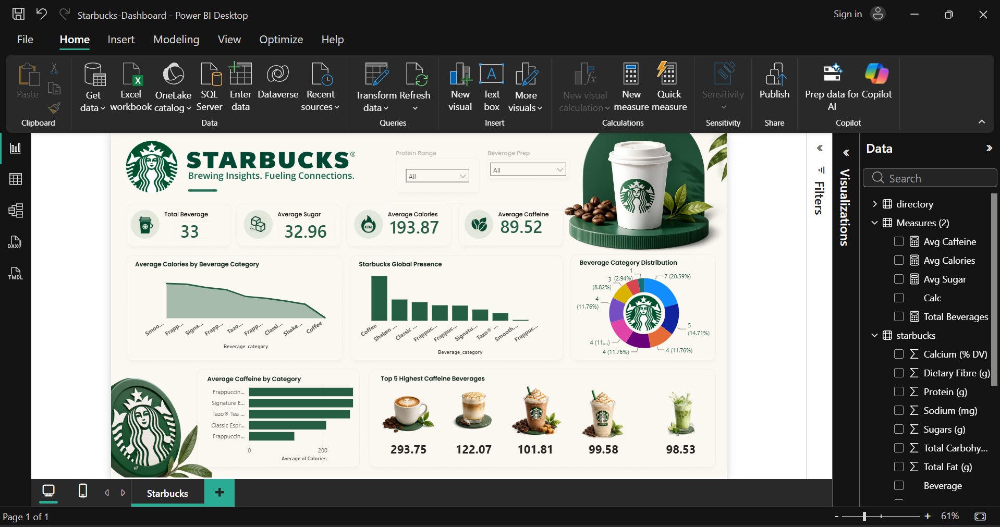
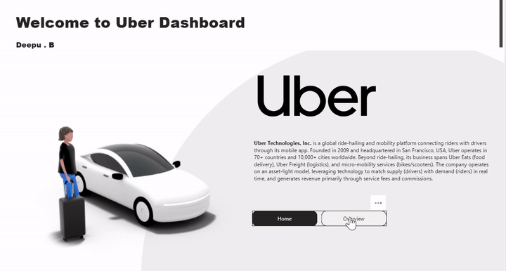
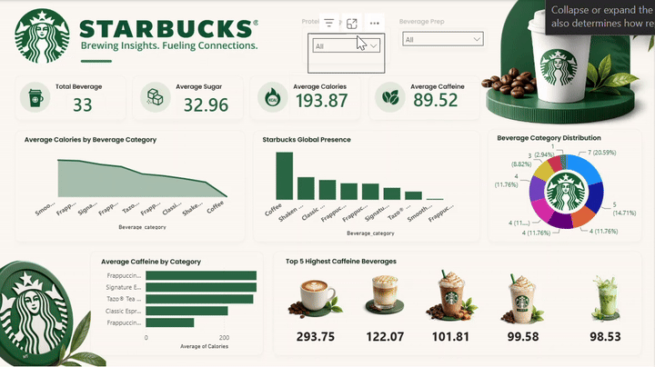

<div align="center">

# 📊 Power BI Dashboards Portfolio

### Turning raw data into decision-ready visual stories

[](https://powerbi.microsoft.com/)
[](https://learn.microsoft.com/en-us/dax/)
[](LICENSE)
[](https://github.com/deepub144-creative)

<br>

**Two end-to-end Power BI dashboards** — one analyzing global ride-hailing operations,
one analyzing beverage nutrition & global retail presence — built with clean data modeling,
custom DAX measures, and interactive, story-driven design.

</div>

---

## 📁 Table of Contents

- [🚗 Uber Business Dashboard](#-uber-business-dashboard)
- [☕ Starbucks Global Insights Dashboard](#-starbucks-global-insights-dashboard)
- [🛠️ Tech Stack](#️-tech-stack)
- [📂 Repository Structure](#-repository-structure)
- [🎥 Live Demos](#-live-demos)
- [🚀 How to Use](#-how-to-use)
- [📬 Connect](#-connect)

---

## 🚗 Uber Business Dashboard

<div align="center">
  
</div>

A ride-hailing performance dashboard tracking revenue, bookings, and distance across every
vehicle category — Auto, Bike, Go Mini, Go Sedan, Premier Sedan, and Uber XL.

<div align="center">
  
</div>

### 🔑 Key Metrics
| Metric | Value |
|---|---|
| 💰 Total Revenue | **52M** |
| 📍 Avg. Distance | **24.64 km** |
| 🚘 Last Bookings | **57K** |
| 📈 Total Distance | **2.51M km** |
| ✅ Completed Bookings | **93K** |

### 📊 Revenue by Vehicle Type
| Vehicle | Revenue |
|---|---|
| Auto | 13M |
| Bike | 11M |
| Go Mini | 10M |
| Go Sedan | 9M |
| Premier Sedan | 6M |
| Uber XL | 2M |

### ✨ Features
- Vehicle-type filter panel (Auto, Bike, Go Mini, Go Sedan, Premier Sedan, Uber XL)
- Month/Quarter toggle for revenue and booking trends
- Trend visualization of completed bookings over time
- Clean, mobile-app-inspired UI layout

---

## ☕ Starbucks Global Insights Dashboard

<div align="center">
  
</div>

An analysis of Starbucks' global beverage nutrition data combined with worldwide store
presence — built to explore how calories, sugar, and caffeine vary across drink categories.

### 🔑 Key Metrics
| Metric | Value |
|---|---|
| 🥤 Total Beverages Analyzed | **33** |
| 🍬 Average Sugar | **32.96 g** |
| 🔥 Average Calories | **193.87 kcal** |
| ⚡ Average Caffeine | **89.52 mg** |

### 🏆 Top 5 Highest-Caffeine Beverages
| Rank | Avg. Calories |
|---|---|
| 🥇 | 293.75 |
| 🥈 | 122.07 |
| 🥉 | 101.81 |
| 4 | 99.58 |
| 5 | 98.53 |

### ✨ Features
- **Average Calories by Beverage Category** — area trend chart
- **Starbucks Global Presence** — store distribution by category
- **Beverage Category Distribution** — donut chart with % share
- **Average Caffeine by Category** — horizontal bar comparison
- Interactive slicers: Protein Range & Beverage Prep (Short/Tall/Grande/Venti)

---

## 🛠️ Tech Stack

<div align="center">


</div>

---

## 📂 Repository Structure

```
Power-BI---Dashboards/
├── assets/
│   ├── uber-home.png
│   ├── uber-overview.gif
│   ├── starbucks-dashboard.png
│   └── starbucks-overview.gif
├── Uber/
│   └── Uber-Dashboard.pbix
├── Starbucks/
│   ├── Starbucks-Dashboard.pbix
│   ├── starbucks.csv
│   └── directory.csv
├── README.md
└── LICENSE
```

> 📌 Update the paths above to match your actual folder names before pushing.

---

## 🎥 Live Demos

### 🚗 Uber Business Dashboard — Walkthrough
<div align="center">
  
</div>

### ☕ Starbucks Insights Dashboard — Walkthrough
<div align="center">
  
</div>

---

## 🚀 How to Use

1. Clone the repo
   ```bash
   git clone https://github.com/deepub144-creative/Power-BI---Dashboards.git
   ```
2. Open the `.pbix` file in **Power BI Desktop**
3. Click **Refresh** to reload data from the source CSVs (if paths change, use **Transform Data** to repoint them)
4. Explore using the built-in slicers and filters

---

## 📬 Connect

<div align="center">

**Deepu B**

[](https://www.linkedin.com/)
[](https://github.com/deepub144-creative)

⭐ If you found this useful, drop a star on the repo!

</div>
